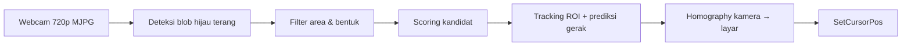

# LED Lightgun Mouse Tracker

Menggerakkan kursor mouse di Windows dengan cara mengarahkan LED hijau (misalnya yang terpasang di lightgun DIY) ke layar. Webcam melacak posisi LED, lalu posisi itu dipetakan ke koordinat layar lewat kalibrasi 4 titik (homography).

Cocok untuk game bergaya *Time Crisis* atau aplikasi apa pun yang dikontrol dengan mouse.

---

## Cara Kerja



1. **Deteksi warna**: pixel dianggap kandidat LED jika cukup terang dan channel hijaunya dominan dibanding merah dan biru.
2. **Filter**: blob yang terlalu kecil, terlalu besar, atau terlalu memanjang (misalnya lampu neon/emergency lamp) dibuang.
3. **Scoring**: setiap kandidat dinilai dari dominansi hijau, kecerahan, ukuran, kerapatan bentuk, jarak dari posisi sebelumnya, dan jarak dari posisi prediksi.
4. **Tracking**: setelah LED terkunci, pencarian hanya dilakukan di area sekitar posisi prediksi (ROI) supaya lebih cepat dan stabil. Jika LED hilang lebih dari beberapa frame, pencarian kembali ke seluruh frame.
5. **Mapping**: posisi LED di kamera diubah ke posisi layar dengan matriks homography dari hasil kalibrasi.

---

## Struktur File

| File | Fungsi |
|---|---|
| `calibration.py` | Kalibrasi 4 pojok layar. Menghasilkan `calibration.npy`. |
| `led_mouse.py` | Program utama: tracking LED dan menggerakkan kursor. |
| `fps_test.py` | Tes FPS murni kamera dengan beberapa konfigurasi (backend, format, exposure). Untuk diagnosis. |
| `color_picker.py` | Tool bantu ganti warna LED: klik glow LED, dapat saran rasio dan kode siap tempel. |
| `calibration.npy` | Matriks homography hasil kalibrasi. Dibuat otomatis, jangan di-commit jika setup kamera tiap orang berbeda. |
| `requirements.txt` | Daftar library Python. |

---

## Kebutuhan

**Software**

- Windows (script memakai `ctypes.windll` dan backend kamera DirectShow)
- Python 3.9 atau lebih baru
- Library: `opencv-python`, `numpy`, `pyautogui`

**Hardware**

- Webcam yang mendukung 1280x720 dengan format MJPG (untuk 30 fps)
- LED hijau yang terpasang di alat penunjuk / lightgun
- Tombol klik ditangani terpisah (misalnya ESP32 sebagai mouse Bluetooth), tidak termasuk di repo ini

---

## Instalasi

```bash
git clone https://github.com/<username>/<nama-repo>.git
cd <nama-repo>
pip install -r requirements.txt
```

---

## Cara Pakai

### 1. Cek kamera (opsional, disarankan saat pertama kali)

```bash
python fps_test.py
```

Pastikan kombinasi `DSHOW MJPG-after exposure-manual` mendapat sekitar 30 fps. Jika semua kombinasi hanya sekitar 10 fps, lihat bagian [Troubleshooting](#troubleshooting).

### 2. Kalibrasi

```bash
python calibration.py
```

1. Arahkan LED ke **pojok kiri atas** layar.
2. Pastikan tulisan di window berubah jadi `LED (x, y)` berwarna hijau.
3. **Klik kiri** di window kalibrasi untuk menyimpan titik.
4. Ulangi untuk **kanan atas**, **kanan bawah**, dan **kiri bawah**.
5. Setelah 4 titik tersimpan, file `calibration.npy` akan dibuat.

Tekan `Q` untuk membatalkan.

> Kalibrasi ulang setiap kali posisi webcam berubah, posisi duduk/berdiri berubah jauh, atau resolusi kamera diganti.

### 3. Jalankan tracking

```bash
python led_mouse.py
```

Saat start, console akan menampilkan info kamera:

```
Camera : 1280 x 720
FPS cam: 30.0
Format : MJPG
Screen : 1920 x 1080
```

Jika `Format` bukan `MJPG`, FPS kemungkinan akan tertahan di sekitar 10.

Selama berjalan, console mencetak FPS dan status tracking setiap detik (`LOCKED` / `LOST`). Tekan `Q` di window debug untuk keluar.

---

## Konfigurasi

Parameter utama ada di bagian atas masing-masing script. Parameter bertanda **(sama)** harus bernilai sama di `calibration.py` dan `led_mouse.py`.

| Parameter | Default | Keterangan |
|---|---|---|
| `CAMERA_INDEX` | `1` | Index webcam. Coba `0` jika kamera tidak terbuka. |
| `WIDTH`, `HEIGHT` **(sama)** | `1280`, `720` | Resolusi kamera. Wajib kalibrasi ulang jika diganti. |
| `CAMERA_FPS` | `30` | FPS yang diminta. Coba `60` jika webcam mendukung. |
| `AUTO_EXPOSURE`, `EXPOSURE` **(sama)** | `0.25`, `-8` | Exposure manual. Makin negatif makin gelap, halo LED makin kecil. |
| `BRIGHTNESS_THRESHOLD` | `100` | Batas minimal kecerahan pixel. |
| `GREEN_R_RATIO` **(sama)** | `1.20` | Hijau harus lebih besar dari merah × nilai ini. Naikkan jika banyak false detect. |
| `GREEN_B_RATIO` **(sama)** | `1.10` | Hijau harus lebih besar dari biru × nilai ini. Turunkan ke ~1.0 jika LED agak kebiruan. |
| `MIN_AREA`, `MAX_AREA` **(sama)** | `2`–`3`, `50000` | Batas ukuran blob (pixel). |
| `ROI_SIZE` | `250` | Setengah lebar area pencarian di sekitar posisi prediksi. |
| `BASE_MAX_JUMP`, `MAX_ADAPTIVE_JUMP` | `150`, `300` | Jarak maksimum LED boleh berpindah antar frame. |
| `LOST_FRAMES_LIMIT` | `5` | Jumlah frame hilang sebelum pencarian ke seluruh frame. |
| `PREDICTION_FACTOR` | `0.8` | Seberapa jauh posisi diprediksi berdasarkan kecepatan. |
| `DEBUG` | `True` | Tampilkan window debug dan FPS. Set `False` untuk performa maksimal. |

---

## Mengganti Warna LED

Script ini tidak memakai nilai RGB target secara langsung (misalnya "cari warna 0, 255, 0"). Cahaya LED di kamera berubah-ubah tergantung jarak, sudut, dan exposure, jadi nilai RGB-nya tidak pernah persis sama. Yang dipakai adalah **perbandingan antar channel**: warna LED ditentukan oleh channel mana yang paling besar dibanding dua channel lainnya.

### Konsep

Setiap pixel punya 3 nilai 0–255 dengan urutan **B, G, R** (format OpenCV). Contoh kasar nilai glow LED di kamera:

| Warna LED | B | G | R |
|---|---|---|---|
| Biru | 250 | 120 | 60 |
| Hijau | 110 | 240 | 70 |
| Merah | 50 | 60 | 250 |

Untuk LED hijau, aturannya: **G harus jelas lebih besar dari R dan B**.

```python
(Gf > Rf * GREEN_R_RATIO)   # G minimal 20% lebih besar dari R (jika rasio 1.20)
&
(Gf > Bf * GREEN_B_RATIO)   # G minimal 10% lebih besar dari B (jika rasio 1.10)
&
(Gf > 80)                   # G sendiri cukup terang
```

- Rasio **lebih besar** → deteksi lebih ketat: false detect berkurang, tapi LED lebih mudah hilang.
- Rasio **lebih kecil** → deteksi lebih longgar: LED lebih mudah terdeteksi, tapi benda lain bisa ikut terdeteksi.

### Cara cepat: pakai `color_picker.py`

```bash
python color_picker.py
```

1. Nyalakan LED dan arahkan ke kamera.
2. **Klik kiri** di **pinggir glow** LED, bukan di tengahnya yang putih. Ambil 3–5 sampel dari beberapa sisi.
3. Console akan menampilkan warna dominan, rasio terukur, rasio yang disarankan, dan **kode siap tempel**, contohnya:

```
Rata-rata     : B=110  G=240  R=70
Warna dominan : GREEN

  G/R terukur = 3.43  ->  saran rasio = 1.71
  G/B terukur = 2.18  ->  saran rasio = 1.09

---------------- TEMPEL KE KEDUA SCRIPT ----------------

# ===== CONFIG =====
GREEN_R_RATIO = 1.71
GREEN_B_RATIO = 1.09

# ===== ganti isi blue_mask =====
    blue_mask = (
        (Gf > Rf * GREEN_R_RATIO)
        &
        (Gf > Bf * GREEN_B_RATIO)
        &
        (Gf > 80)
    )

# ===== ganti isi local_blue =====
        local_blue = (
            (local_G > local_R * GREEN_R_RATIO)
            &
            (local_G > local_B * GREEN_B_RATIO)
        )
```

4. Tekan **M** untuk melihat preview mask dengan rasio yang disarankan. LED harus tampil putih dan background hitam. Tekan **R** untuk reset sampel.
5. Tempel hasilnya ke **`calibration.py` dan `led_mouse.py`** (lihat bagian di bawah), lalu **kalibrasi ulang**.

Rasio yang disarankan adalah setengah dari rasio terukur (minimal 1.05), supaya LED tetap terdeteksi walaupun cahayanya sedikit berubah.

### Bagian yang diganti di script

Di **setiap** script (`calibration.py` dan `led_mouse.py`) ada 3 tempat:

| Tempat | Letak | Isi |
|---|---|---|
| Konstanta rasio | Bagian CONFIG di atas | `GREEN_R_RATIO`, `GREEN_B_RATIO` |
| `blue_mask` | Di `find_led()` / `detect_candidates()` | Aturan warna untuk seluruh gambar |
| `local_blue` | Di fungsi yang sama, bagian ratio lokal | Aturan yang sama untuk area sekitar blob (dipakai scoring) |

Aturan di `blue_mask` dan `local_blue` harus selalu sama. Nama variabelnya masih "blue" dari versi awal (saat LED masih biru). Namanya tidak berpengaruh, yang menentukan warna adalah isinya.

> Jika nama konstanta berubah (misalnya dari `GREEN_R_RATIO` ke `RED_G_RATIO`), pastikan semua tempat yang memakainya ikut diganti.

### Template manual

Pilih channel utama, lalu bandingkan dengan dua channel lainnya:

| Warna | `blue_mask` | `local_blue` |
|---|---|---|
| Merah | `(Rf > Gf * r1) & (Rf > Bf * r2) & (Rf > 80)` | `(local_R > local_G * r1) & (local_R > local_B * r2)` |
| Hijau | `(Gf > Rf * r1) & (Gf > Bf * r2) & (Gf > 80)` | `(local_G > local_R * r1) & (local_G > local_B * r2)` |
| Biru | `(Bf > Rf * r1) & (Bf > Gf * r2) & (Bf > 80)` | `(local_B > local_R * r1) & (local_B > local_G * r2)` |

Warna campuran (kuning = R+G, cyan = G+B, ungu = R+B) punya dua channel tinggi sekaligus, jadi tidak bisa memakai template di atas. Untuk warna seperti ini, `color_picker.py` akan memberi peringatan. LED merah, hijau, atau biru murni paling mudah dan paling stabil dideteksi.

---

## Troubleshooting

**LED tidak terdeteksi saat menghadap lurus ke kamera, tapi terdeteksi saat menghadap samping**

Cahaya LED terlalu kuat sehingga muncul halo besar dan blob-nya melewati `MAX_AREA`. Solusi, dari yang paling disarankan:

- Redupkan LED (resistor lebih besar atau PWM).
- Pasang diffuser tipis (selotip putih/kertas) di depan LED.
- Turunkan `EXPOSURE` (misalnya `-10` atau `-11`) di kedua script.
- Naikkan `MAX_AREA` di kedua script.

**FPS tertahan di sekitar 10**

Kamera berjalan dalam format YUY2. Dengan backend DirectShow, `CAP_PROP_FOURCC` = MJPG harus di-set **setelah** resolusi (sudah diterapkan di script). Jalankan `fps_test.py` untuk memastikan. Jika semua kombinasi tetap 10 fps, matikan fitur *low-light compensation* (misalnya RightLight pada webcam Logitech) di software bawaan webcam.

**Banyak false detect dari benda hijau lain**

Naikkan `GREEN_R_RATIO` (misalnya `1.4`) dan/atau `BRIGHTNESS_THRESHOLD`, atau turunkan `EXPOSURE` supaya hanya LED yang cukup terang untuk lolos. Cek hasilnya dengan preview mask di `color_picker.py` (tombol **M**).

**Kursor meleset dari titik yang ditunjuk**

Kalibrasi ulang. Pastikan setting kamera (resolusi, format, exposure) sama persis antara saat kalibrasi dan saat tracking.

**Kamera tidak terbuka**

Ganti `CAMERA_INDEX`, dan pastikan tidak ada program lain (termasuk script lain dari repo ini) yang sedang memakai kamera.

---

## Lisensi

Tambahkan lisensi sesuai kebutuhan (misalnya MIT).
